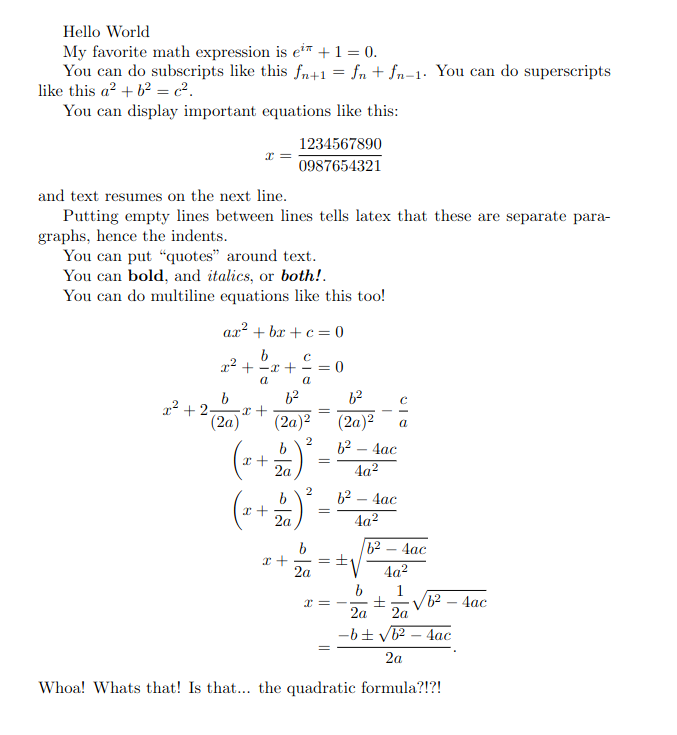

A Small Preface
================

The (Brief) History (of LaTeX)
----------------------------------
Well... LaTeX was first created in 1985 by Leslie Lamport.
Its a free open-source software package created as an addition
to the TeX typesetting system. For reference, TeX essentially took text
like {\\it this text is italic} and formatted it like *this text is italic*.
Because of its extensive and powerful capabilities the TeX system became very widely adopted.
In 1985, LaTeX was created to generate general-purpose books, articles, etc in a better way.
Fast forward to today, LaTeX is the *de facto* standard for writing academic papers, research papers,
format mathematical equations, and express formal notation in a reproducable way.

TL;DR Everyone uses LaTeX because its awesome and you should to!

But what *actually* is it?
-----------------------------
From a practical standpoint, LaTeX source code looks like this, and you get a pdf like that.

.. code-block:: latex

    \documentclass[12pt]{article}  % required for all latex documents

    % pssst, "documentclass" is a command, and "article" is a required argument to that command
    % and the "12pt" is an optional argument to that command
    % also "%" is the comment character, anything after it on the line is ignored by latex

    % this space before "\begin{document}" is whats known as the preamble, it sets up the document

    \usepackage{amsmath} % needed for \begin{align}...\end{align}, \begin{equation}...\end{equation}, etc.

    \begin{document}  % required, everything that we want to *see* must be between \begin{document} and \end{document}

    Hello World

    My favorite math expression is $e^{i\pi} + 1 = 0$.  % the $...$ tells latex to display the math expression inline

    You can do subscripts like this $f_{n+1} = f_{n} + f_{n-1}$.
    You can do superscripts like this $a^2 + b^{2} = c^{2}$.

    You can display important equations like this: $$x = \frac{1234567890}{0987654321}$$ and text resumes on the next line.
    % the $$...$$ tells latex to display the math expression on its own line (and centered!)

    
    Putting empty lines between lines tells latex that these are separate paragraphs, hence the indents.

    You can put ``quotes" around text.

    You can \textbf{bold}, and \textit{italics}, or \textbf{\textit{both!}}.

    You can do multiline equations like this too!
    \begin{align*}  % the "*" tells latex not to label each equation-line with a number, try removing it!
        ax^2 + bx + c &= 0\\
        % the "&" is called an alignment character because thats where latex aligns the lines too
        % the "\\" tells latex to display on the next line
        x^2 + \frac{b}{a}x + \frac{c}{a} &= 0\\ % \frac{top}{bottom} is for fractions
        x^2 + 2\frac{b}{(2a)}x + \frac{b^2}{(2a)^2}&= \frac{b^2}{(2a)^2}-\frac{c}{a}\\
        \left(x + \frac{b}{2a}\right)^2 &= \frac{b^2 - 4ac}{4a^2}\\
        % \left( something \right) scales the parantheses depending on how big the insides are
        \left(x + \frac{b}{2a}\right)^2 &= \frac{b^2 - 4ac}{4a^2}\\
        x + \frac{b}{2a} &= \pm \sqrt{\frac{b^2 - 4ac}{4a^2}}\\
        % \pm is the plus-minus character
        % \sqrt is for roots, fun fact you can do nth-roots with \sqrt[n]{stuff}
        x  &= -\frac{b}{2a} \pm \frac{1}{2a}\sqrt{b^2 - 4ac}\\
          &= \frac{-b\pm \sqrt{b^2 - 4ac}}{2a}.
    \end{align*}
    Whoa! Whats that! Is that... the quadratic formula?!?!

    \end{document}

You can check this out and play around with it on `Overleaf here <https://www.overleaf.com/read/pbjsmvgnmhnp#30a32a>`_.
Pretty cool right???

Pros and Cons
------------------
But slow down there. 
Before you dive head first into this awesome guide you should 
know the advantages and disadvantages of using LaTeX. Then can decide whether or not LaTeX is right for you!

.. list-table::
   :widths: 50 50
   :header-rows: 1

   * - LaTeX Pros
     - LaTeX Cons
   * - Copy and Paste similar lines of algebra without retyping.
     - 
   * - Consistent text formatting
     - Messy handwriting! (Do you ever squish text to fit on the end of a line?)
   * - Saves paper
     - LaTeX can be confusing at times.
   * - Make pretty graphs/figures.
     - 
   * - Scanning is a thing of the past.
     - 
   * - No erase marks!
     - 
   * - Super-duper readable.
     -  
   * - Import pictures of handrawn work from your phone when needed.
     - 
   * - No need to worry about losing your work.
     -
   * - Draw pretty figures native in latex!
     - 

.. list-table::
   :widths: 50 50
   :header-rows: 1

   * - Handwriting Pros
     - Handwriting Cons
   * - No need for a computer!
     - Repetitive calculations = Sore Wrist

.. What you can become!
.. -----------------------

.. I know that when I started learning LaTeX it all seemed kind of overwhelming and confusing.
.. Trust me, its normal. But I promise you that with time and effort you can become proficient with LaTeX.
.. This guide is hear to make your journey as smooth as possible coming from students who learned it by themselves :).

